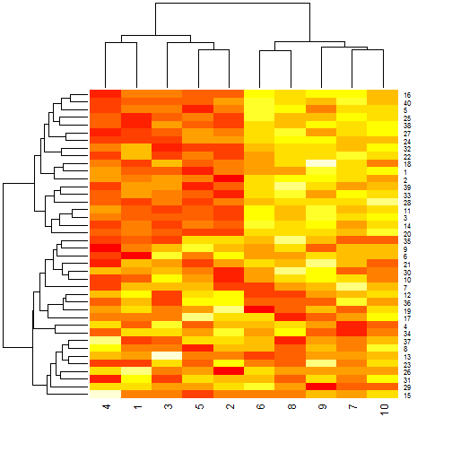
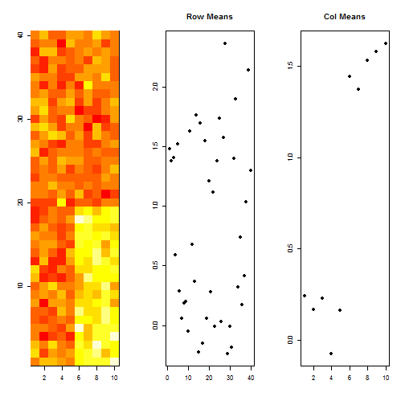
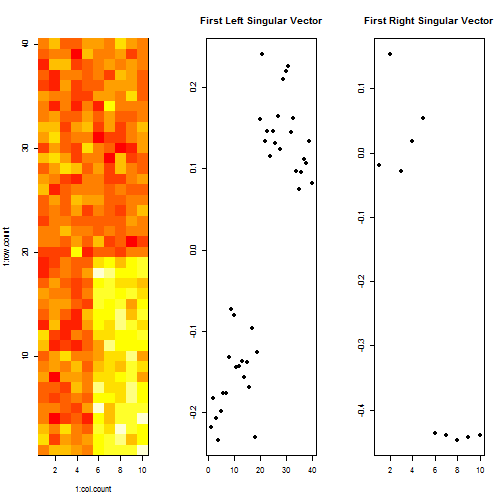

Singular Value Decomposition
========================================================
author: Alexander Alexandrov
date: Saturday, March 12, 2016

SVD Overview
========================================================

Visualization of the SVD of a two-dimensional, real shearing matrix **M**. The SVD decomposes **M** into three simple transformations.

1. Rotation **V***
2. Scaling **Σ**
3. Rotation **U**

Random Data
========================================================

Let's generate some random data 40x10. Then add some pattern. So most of the rows from 5 up to 10 column are shifted by some value.

Hierarchical Clustering
========================================================

Pattern *injected* into the random data is not evident.

Hierarchical Clustering + SVD
========================================================

First singular vectors have *catched* most of the variance and pattern has become evident.
